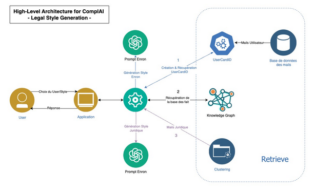
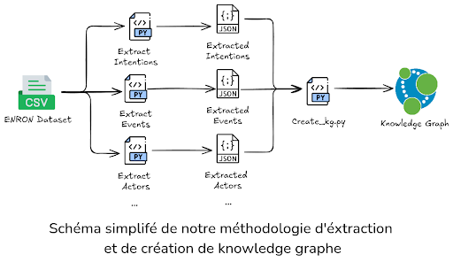
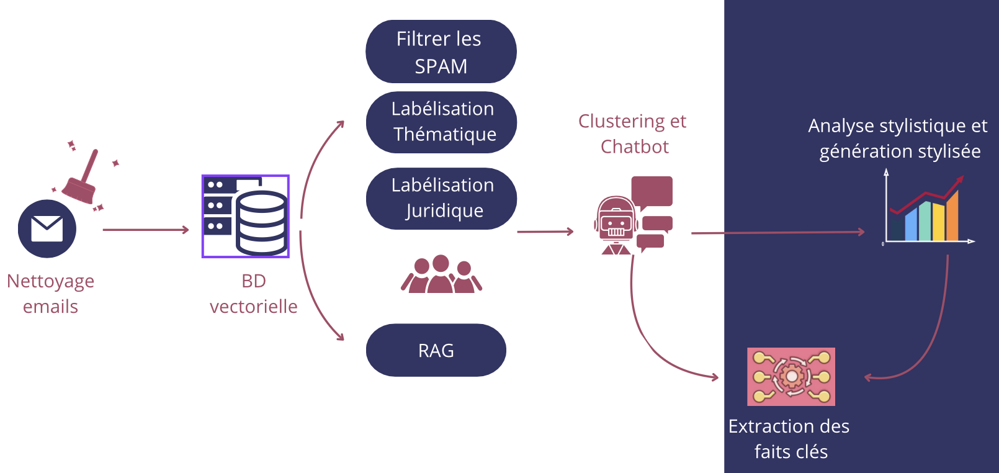

# Legal-Email-Styling

---

## 📌 Project Overview

Legal Email is a project focused on analyzing email datasets, particularly the Enron emails dataset, to understand and define juridical email styling.


The project is structured into three main components:

1. **Knowledge Graph**: A structured representation of emails to visualize and analyze relationships.


   

2. **Semantic Clustering**: Creating embeddings of email content to analyze semantic aspects and extract patterns.

   

3. **Email Generation with custom styles**: Defining various email styles (legal, personal, etc.) and generating emails based on the selected style and a user's chronological events.

   

---

## 🔄 Project Workflow

The project workflow consists of the following steps:
1. **Data Extraction and Preprocessing**: Parsing emails, extracting relevant entities, and structuring the data.
2. **Knowledge Graph Construction**: Visualizing email relationships.
3. **Clustering and Embeddings**: Applying NLP techniques to analyze email semantics.
4. **Email Style Definition**: Defining various email styles based on legal and user preferences.
5. **Email Generation**: Creating an AI-powered system to generate emails using some advanced prompt-engineering techniques based on predefined styles.
6. **Frontend App Development**: Building a Streamlit-based application to showcase the results.

---

## 🚀 Future Work

- Implementing unit tests for various components of the project.
- Enhancing email style generation by incorporating user feedback.
- Expanding the knowledge graph with more enriched relationships.
- Improving clustering algorithms for better semantic analysis.

---

## 🛠️ Technologies

This project leverages the following technologies:

- **Programming Languages**: Python
- **Frameworks & Libraries**:
  - Streamlit (for UI development)
  - NetworkX (for knowledge graph)
  - Transformers (for embeddings)
  - Scikit-learn (for clustering)
  - Pandas & NumPy (for data processing)
- **Database & Storage**:
  - JSON and CSV and Pickle files for data storage

- **Visualization**:
  - Matplotlib & Seaborn
  - Graph visualization tools

---

## 🛠️ Getting Started

Follow these steps to run the project:

1. **Clone the repository**:

   ```bash
   git clone https://github.com/ilyesdjerfaf/Legal-Email-Styling.git
   cd Legal-Email-Styling
   ```

2. **Create a virtual environment**:
   ```bash
   python -m venv venv
   source venv/bin/activate    # On Windows: venv\Scripts\activate
   ```

3. **Install dependencies**:
   ```bash
   pip install -e .
   ```

4. **Run App**:
   ```bash
   streamlit run app/1_Home.py
   ```

---

## 📂 Project Structure

```
Legal-Email-Styling/
├── app/
│   ├── 1_Home.py
│   ├── assets/
│   ├── pages/
│   ├── utils/
├── data/
│   ├── extraction_data/
├── notebooks/
│   ├── EDA.py
│   ├── plots/
├── src/
│   ├── generation/
│   ├── knowledge-graph/
├── tests/
├── images/
├── requirements.txt
├── setup.py
├── CONTRIBUTING.md
├── README.md
```

### Key Components:
- **`/app`**: Streamlit-based UI for showcasing the project.
- **`/data`**: Contains extracted and processed email data.
- **`/notebooks`**: Jupyter notebooks for exploratory data analysis.
- **`/src`**: Backend scripts for each main component (Knowledge Graph, Clustering, Email Generation).
- **`/tests`**: Placeholder for unit tests (not fully implemented).
- **`requirements.txt`**: Lists all required dependencies.
- **`setup.py`**: Defines the repository setup.
- **`CONTRIBUTING.md`**: Guidelines for contributing.

---

## 🤝 Collaboration and Contributions

We welcome contributions! Please refer to the [CONTRIBUTING.md](./CONTRIBUTING.md) file for guidelines on how to collaborate on this project.

---

## 📧 Contact

For any queries or collaboration opportunities, feel free to reach out through the repository.

---

