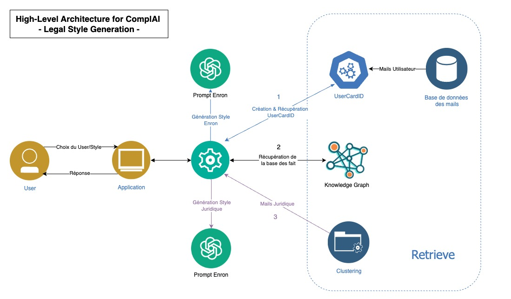

# Legal-Email-Styling

---

## 🔄 Project Workflow



---

## 🚀 Future Work

---

## 🛠️ Technologies

---

## 🛠️ Getting Started

Follow these steps to run the project:

1. **Clone the repository**:

```bash
   git clone https://github.com/ilyesdjerfaf/Legal-Email-Styling.git
   cd Legal-Email-Styling
```

2. **Create a virtual environment**:
   ```bash
   python -m venv venv
   source venv/bin/activate    # On Windows: venv\Scripts\activate
   ```

3. **Install dependencies**:
   ```bash
   pip install -e .
   ```

4. **Run App**:
   ```bash
   streamlit run app/app.py
   ```
---

## 🤝 Collaboration and Contributions

We welcome contributions! Please refer to the [CONTRIBUTING.md](./CONTRIBUTING.md) file for guidelines on how to collaborate on this project.

---

## 📧 Contact

For any queries or collaboration opportunities, feel free to reach out through the repository.

---